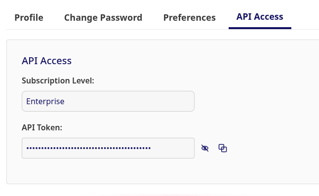

# FastCatalog.ai API Examples

This repository provides simple Python and JavaScript code samples for interacting with the [FastCatalog.ai API](https://api.fastcatalog.ai/docs). Each example demonstrates a specific API scenario, such as searching for datasets, retrieving metadata, generating spreadsheets reports, and more.

## Overview

The examples are organized into scenario-based folders under `examples/`, each with both `.js` (JavaScript) and `.py` (Python) implementations.

### Example Scenarios

1. **Search by Dataset URL**  
   Search the catalog for a dataset using its homepage URL.

2. **# Find and retrieve details**
    This example searches the catalog for a dataset using its URL as a filter, and retrieves its details using its UUID. Finally a summary is prepared from the retrieved object, highlighting some important information.


3. **Get Dataset Terms**  
   Retrieve details of a dataset, including its terms, by UUID.

4. **Get AI Model Provenance (Lineage)**  
   Retrieve lineage/provenance information for an AI model using its UUID.

5. **Generate Dataset Spreadsheet**  
   Generate and download a spreadsheet for a catalog entry.

## Usage

### Prerequisites

- Node.js and/or Python 3.x installed.
- [FastCatalog.ai API token](https://api.fastcatalog.ai/) saved as `FASTCATALOG_TOKEN` in `secrets/keys.env`.

### How to obtain your FastCatalog.ai API token

1. Go to [https://app.fastcatalog.ai/settings](https://app.fastcatalog.ai/settings)
2. Navigate to the API Access tab

3. Click the icon to copy the API token

### Running the examples

Python

```bash
./run_all_python_examples.sh
```

JS

```bash
./run_all_js_examples.sh
```

